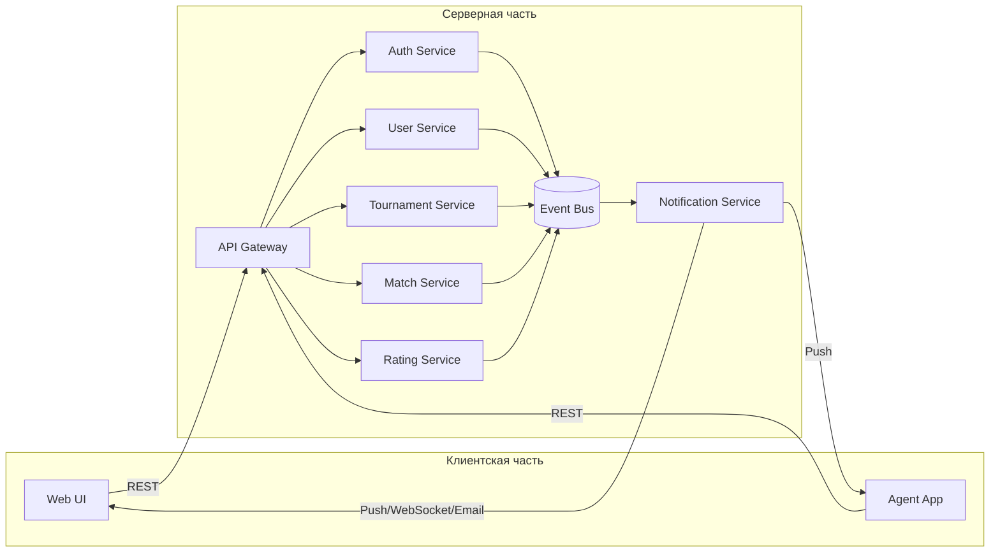

# Домашнее задание

Разработать микросервисную архитектуру для игры Космический бой.

## Цель

Представить в виде одной или нескольких диаграмм архитектуру приложения для игры Космический бой.
Разбить Игру Космический бой на набор взаимодействующих между собой микросервисов и приложений.

## Описание

Космические бои могут проводить только зарегистрированные пользователи.
Космические бои проводятся как в рамках турниров, либо между любыми пользователями по договоренности.
Можно посмотреть список будущих турниров, подать заявку на участие в турнире, посмотреть результаты проходящих турниров, уже прошедших.
Участники боев получают уведомления о приглашении на турнир, решение по заявке на участие в турнире, о завершении боя, о скором начале боя.
Игрок может посмотреть прошедший бой.
За места в турнире участники получают рейтинговые очки.
Каждый пользователь может организовать свой турнир.
Турниры получают рейтинг, который рассчитывается на основе рейтингов ее участников.
Турнир может быть регулярным, тогда рейтинг его накапливается.
Игрок принимает участие в игре посредством программы, которая загружается в специальное приложение Агент.

# Решение

## Краткое описание

В серверной части приложения можно выделить следующие микросервисы:

* **API Gateway** – точка входа для внешних запросов клиента и Агентов.
* **Auth Service** – управляет регистрацией, аутентификацией и авторизацией пользователей.
* **User Service** – хранит и управляет профилями игроков.
* **Tournament Service** – CRUD турниров и заявок на участие, рассчитывает рейтинги турниров.
* **Match Service** – организует и записывает результаты отдельных боёв (матчей).
* **Rating Service** – рассчитывает и хранит рейтинги игроков по итогам матчей.
* **Notification Service** – производит централизованную рассылку уведомлений по событиям через очередь сообщений.

Клиентская часть приложения состоит из:

* **Agent App** – игровое приложение, через которое игроки принимают участие в боях.
* **Web UI** – веб-приложение для взаимодействия с микросервисами, просмотра турниров и результатов.

Асинхронная коммуникация между микросервисами реализована по event-driven паттерну через шину событий (Kafka или RabbitMQ).

Синхронные запросы от Web UI и Agent App поступают через REST API на API Gateway, который отвечает за аутентификацию (через соответствующий микросервис), а потом перенаправляет в один или несколько микросервисов.

Для уведомления пользователя о событиях в системе используются механизмы Push-уведомлений, Web-сокеты или Email-сообщения, в зависимости от типа уведомления.

## Диаграмма архитектуры приложения

## Подробное описание функций микросервисов и их точек входа.

### Auth Service

* **POST /auth/register** – регистрация нового пользователя.

* **POST /auth/login** – вход, выдача JWT-токена.

* **POST /auth/refresh** – обновление JWT-токена.

* Публикует событие **UserRegistered** в Event Bus.

### User Service

* **GET /users/{id}** – возвращает профиль пользователя.

* **PUT /users/{id}** – обновляет профиль пользователя.

* Подписывается на **UserRegistered** в Event Bus для инициализации профиля пользователя.

### Tournament Service

* **GET /tournaments** – возвращает список турниров (возможны фильтры: будущие, текущие, прошедшие).

* **POST /tournaments** – создает турнир (только авторизованный для этого пользователь).

* **POST /tournaments/{id}/apply** – подача заявки пользователем на участие в турнире.

* **GET /tournaments/{id}/results** – возвращает результаты прошедшего турнира.

* Публикует события: **TournamentCreated**, **TournamentApplicationDecided**, **TournamentStarted**, **TournamentEnded** в Event Bus.

### Match Service

* **POST /matches** – создает матч (автоматически при старте турнира или по запросу между игроками).

* **PUT /matches/{id}/result** – загружает результаты матча.

* **GET /matches/{id}** – реализует просмотр прошедшего матча.

* Публикует события: **MatchCompleted** в Event Bus.

### Rating Service

* **GET /ratings/{userId}** – возвращает текущий рейтинг игрока.

* **POST /ratings/calculate** – запускает расчет рейтинга (может вызываться по расписанию).

* Подписывается на события **MatchCompleted** и **TournamentEnded** в Event Bus для обновления рейтинга игроков.

### Notification Service

* **GET /notifications/{userId}** – возвращает историю уведомлений пользователя.

* **POST /notifications/{userId}/preferences** – управляет каналами и типами уведомлений пользователя.

* Подписывается в Event Bus на все события, которые могут быть интересны пользователям, и генерирует уведомления по шаблонам.

* Отправляет уведомления различным каналам пользователям.

### API Gateway

Единственна точка входа для REST-запросов. Выполняет маршрутизацию, проверку JWT-токенов, кеширует запросы (по возможности) и т.п.

### Agent App и Web UI

Клиентские приложения, обращаются к API Gateway по REST и получающие уведомления от Notification Service через различные каналы коммуникаций (Push-уведомления, Web-сокеты, Email-сообщения).

## Потоки сообщений и коммуникации (примеры)

* Регистрация: Web UI → API Gateway → Auth Service (register) → EventBus (UserRegistered) → User Service → Notification Service (Welcome) → Web UI
  
* Создание турнира: Web UI → API Gateway → Tournament Service (tournaments) → EventBus (TournamentCreated) → Notification Service (участникам) → Web UI

* Подача заявки: Web UI → API Gateway → Tournament Service (apply) → EventBus (TournamentApplicationDecided) → Notification Service (заявителю) → Web UI

* Матч: Agent App → API Gateway → Match Service → EventBus (MatchCompleted) → Rating Service → EventBus (RatingUpdated) → Notification Service → Web UI и/или Agent App 

## Потенциальные узкие места и возможности масштабирования.

### API Gateway

**Узкое место:** Большое количество и частота поступления входящих запросов. Потенциально единственная точка отказа в коммуникации с пользователями.

**Возможное решение:** Использование автоскейлинга, загрузка из CDN, кэширование ответов.

### Event Bus

**Узкое место:** Потенциально единственная точка отказа в коммуникации между микросервисами. Узкое горлышко при росте количества сообщений между микросервисами.

**Возможное решение:** Переход на распределённый вариант брокера, шардирование.

### Notification Service

**Узкое место:** Очередь уведомлений для отправки. Потенциально единственная точка отказа.

**Возможное решение:** Горизонтальное масштабирование воркеров.

### Rating Service

**Узкое место:** Тяжёлый расчёт (миллионы матчей). Длительное выполнение.

**Возможное решение:** CQRS: отдельный read-контур, event sourcing для истории.

### Базы данных (для разных микросервисов)

**Узкое место:** Высокая нагрузка на БД у отдельных сервисов (турниры, матчи). 

**Возможное решение:** Шардирование, репликация, CQRS разделение чтения и записи.

## Потенциальные компоненты с изменяющимися требованиями.

### Notification Service

**Источник изменения:** Появление новых каналов для доставки уведомлений. Изменения в уже существующих каналах.

**Возможное решение:** Добавлением новых обработчиков, без изменения кода основного сервиса.

### Tournament Service

**Источник изменения:** Разные типы турниров (регулярные, разовые). Добавление новых типов турниров.

**Возможное решение:** Правила расчёта рейтингов выносятся в отдельные стратегии (шаблон Стратегия).

### Match Service

**Источник изменения:** Могут добавляться новые режимы боя, изменятся правила.

**Возможное решение:** Создаётся фабрика матчей для реализации нужного класса правил без правки существующего кода.
